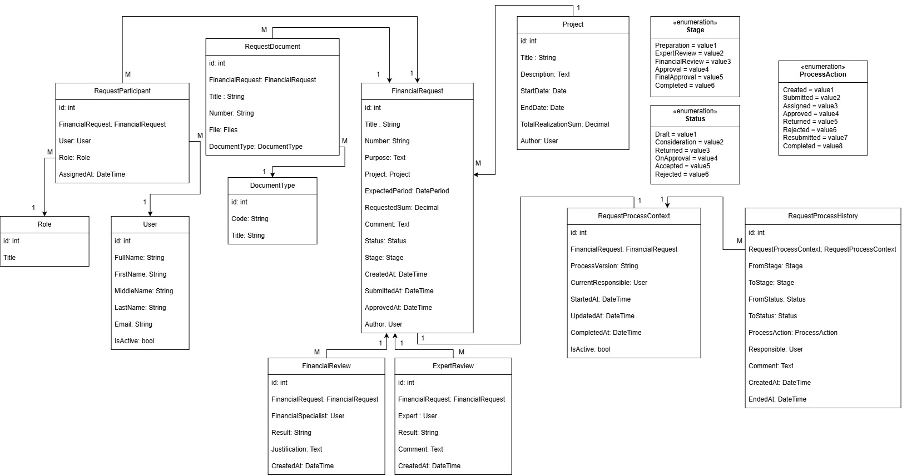

# 04. Доменная модель

Доменная модель описывает основные сущности системы подачи заявок на финансирование, их взаимосвязи и состояние заявки на разных этапах обработки.

В центре модели находится **FinancialRequest** — заявка на финансирование. Вокруг неё связаны данные проекта, документы, участники, результаты проверок и состояние бизнес-процесса.

## UML

## Ключевые решения

### Заявка как центральная сущность

`FinancialRequest` содержит основные данные заявки и ссылки на связанные объекты:

* проект и запрашиваемую сумму;
* автора и участников обработки;
* документы;
* результаты экспертной и финансовой проверки;
* текущие `Status` и `Stage`.

При этом данные процесса обработки вынесены в отдельные сущности.

### Участники и роли

`RequestParticipant` связывает заявку с пользователем и его ролью в рамках конкретной заявки.

Это позволяет не хранить ответственного или согласующего непосредственно в `FinancialRequest` и поддерживать несколько участников с разными ролями.

### Проверки

Результаты экспертной и финансовой проверки хранятся отдельно:

* `ExpertReview` — заключение эксперта;
* `FinancialReview` — результат финансовой экспертизы.

Так бизнес-данные заявки не смешиваются с результатами отдельных этапов проверки.

### Управление бизнес-процессом

`RequestProcessContext` хранит данные текущего экземпляра процесса.

`RequestProcessHistory` фиксирует переходы между этапами и статусами: кто выполнил действие, из какого состояния произошёл переход и когда это произошло. Кто и как обосновывал свои решения в комментариях

### Статус и Стадия

Состояние заявки разделено на два измерения:

* **Status** — общее состояние заявки: `Draft` (подготовка, черновик), `Consideration` (на рассмотрении), `Returned` (на доработке), `OnApproval` (на утверждении), `Accepted` (утверждена), `Rejected` (отклонена);
* **Stage** — текущий этап процесса: `Preparation`, `ExpertReview`, `FinancialReview`, `Approval`, `FinalApproval`.

Например, заявка может находиться на этапе `FinancialReview` и иметь статус `Consideration`.

---

[← Предыдущий раздел: Бизнес-процесс](03-Бизнес-процесс.md) · [Следующий раздел: База данных →](05-База%20данных.md)

К портфолио → [Портфолио](./00-Портфолио.md)
