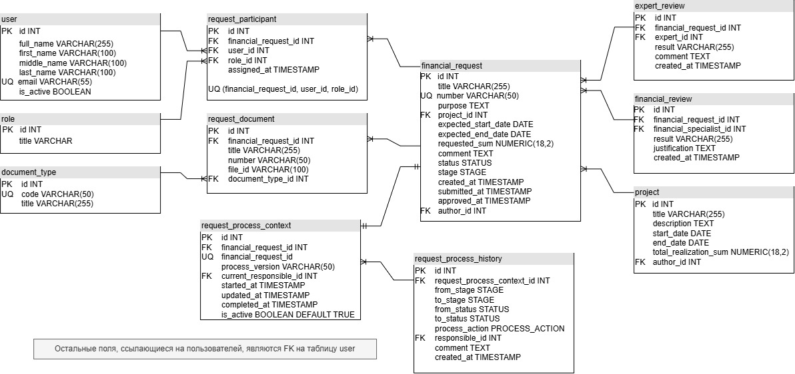

# 05. База данных

Реляционная база данных системы реализуется на **PostgreSQL**.

Доменная модель из предыдущего раздела преобразована в набор связанных таблиц. Для обеспечения целостности данных используются первичные и внешние ключи, уникальные ограничения и типы `ENUM`.

## ERD



## Ключевые решения

### Типы данных

Типы данных выбраны исходя из назначения полей:

* `INT` — идентификаторы и внешние ключи;
* `VARCHAR(n)` — строковые значения с ограниченной длиной;
* `TEXT` — описания, комментарии и обоснования;
* `NUMERIC(18,2)` — денежные значения;
* `DATE` — календарные даты;
* `TIMESTAMP` — дата и время событий;
* `BOOLEAN` — логические признаки.

### Связи между сущностями

`financial_request` является центральной таблицей модели.

Основные связи:

* `project → financial_request` — 1:M;
* `financial_request → request_document` — 1:M;
* `financial_request → request_participant` — 1:M;
* `financial_request → expert_review` — 1:M;
* `financial_request → financial_review` — 1:M;
* `financial_request → request_process_context` — 1:1;
* `request_process_context → request_process_history` — 1:M.

Поля, ссылающиеся на пользователей, реализованы как внешние ключи на таблицу `user`.

В случае необходимости запуска регламентного процесса на различных версиях или параллельно, financial_request → request_process_context может быть реализована в виде 1:M, тогда в context необходимо будет добавить version: int

### Ограничения целостности

Для предотвращения дублирования и нарушения связности данных используются уникальные ограничения:

* `financial_request.number` — уникальный номер заявки;
* `(financial_request_id, user_id, role_id)` в `request_participant` — пользователь не может быть повторно назначен на ту же роль в рамках одной заявки;
* `financial_request_id` в `request_process_context` — одна заявка имеет один контекст процесса;
* `code` в `document_type` - уникальный код типа документа.

### Статусы и этапы

`status`, `stage` и `process_action` реализованы как PostgreSQL `ENUM`.

`status` отражает состояние заявки:

```text
Draft
Consideration
Returned
OnApproval
Accepted
Rejected
```

`stage` определяет текущий этап процесса:

```text
Preparation
ExpertReview
FinancialReview
Approval
FinalApproval
Completed
```

`process_action` фиксирует выполненное действие:

```text
Created
Submitted
Assigned
Approved
Returned
Rejected
Resubmitted
Completed
```

### Хранение документов

В `request_document` хранится `file_id`, а не содержимое файла.

Файлы предполагается размещать во внешнем файловом хранилище, а в базе данных хранить только идентификатор, необходимый для обращения к файлу.

### История процесса

`request_process_history` хранит историю переходов заявки между этапами и статусами.

Для каждого события фиксируются:

* предыдущий и новый этап;
* предыдущий и новый статус;
* выполненное действие;
* ответственный пользователь;
* комментарий;
* время события.

---

[← Предыдущий раздел: Доменная модель](04-Доменная%20модель.md) · [Следующий раздел: API →](06-API.md)

[К портфолио →](00-Портфолио.md)
