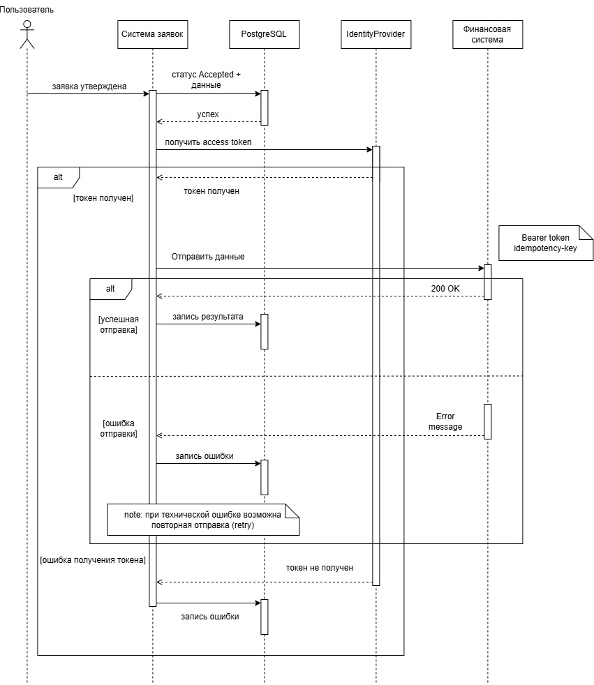

# 07. Интеграции

Система взаимодействует с внешними системами для аутентификации пользователей, хранения файлов документов и передачи данных об утверждённых заявках во внешнюю финансовую систему.

| Система            | Назначение                                                      | Направление                  |
| ------------------ | --------------------------------------------------------------- | ---------------------------- |
| Identity Provider  | Аутентификация пользователей и получение `access token`         | Система ↔ Identity Provider  |
| Файловое хранилище | Хранение файлов документов заявки                               | Система ↔ Файловое хранилище |
| Финансовая система | Передача данных утверждённых заявок и параметров финансирования | Система → Финансовая система |

## 7.1. Identity Provider

Identity Provider используется для аутентификации пользователей и получения данных, необходимых для авторизации операций в системе.

Для аутентификации используется **OAuth 2.0**. После успешной аутентификации клиент получает `access token` и передаёт его при обращении к API:

```http
Authorization: Bearer <access-token>
```

Общая последовательность:

```text
Клиент → Аутентификация → Identity Provider → Access Token → Клиент → Authorization: Bearer <token> → API системы
```

API проверяет полученный токен и определяет пользователя, от имени которого выполняется операция.

## 7.2. Файловое хранилище

Файлы документов заявки хранятся во внешнем файловом хранилище. В основной БД сохраняется идентификатор файла `file_id`, связанный с сущностью `request_document`.

При добавлении документа система:

1. передаёт файл в файловое хранилище;
2. получает идентификатор файла;
3. сохраняет `file_id` в `request_document`.

При получении документа система использует `file_id` для обращения к файловому хранилищу.

## 7.3. Финансовая система

После финального утверждения заявки данные об утверждённой заявке должны быть переданы во внешнюю финансовую систему.

### Последовательность взаимодействия

1. Заявка получает статус `Accepted` и этап `Completed`.
2. Система формирует сообщение о необходимости передачи данных.
3. Сообщение передаётся в RabbitMQ.
4. Integration Worker получает сообщение и выполняет обработку интеграционной операции.
5. Worker получает необходимые данные заявки из БД.
6. Worker формирует HTTP-запрос во внешнюю финансовую систему.
7. В запрос передаются данные утверждённой заявки, `Bearer token` и уникальный `Idempotency-Key`.
8. Финансовая система обрабатывает запрос и возвращает результат.
9. Результат интеграционного взаимодействия сохраняется в системе.
10. При временной технической ошибке выполняется повторная обработка сообщения.
11. После исчерпания количества попыток сообщение перемещается в Dead Letter Queue.

### Передаваемые данные

Передача включает данные, необходимые внешней финансовой системе для регистрации принятого решения и параметров финансирования:

* идентификатор и номер заявки;
* данные проекта;
* сумму финансирования;
* параметры финансирования;
* данные принятого решения.

### Идемпотентность

Повторная передача данных одной и той же утверждённой заявки не должна приводить к повторному созданию финансовой операции.

Для каждой операции передачи формируется уникальный `Idempotency-Key`. 

### Sequence Diagram

Последовательность взаимодействия после утверждения заявки представлена на диаграмме:



[← Предыдущий раздел: База данных](06-API.md) · [Следующий раздел: Архитектура →](08-Архитектура.md)

[К портфолио →](00-Портфолио.md)
